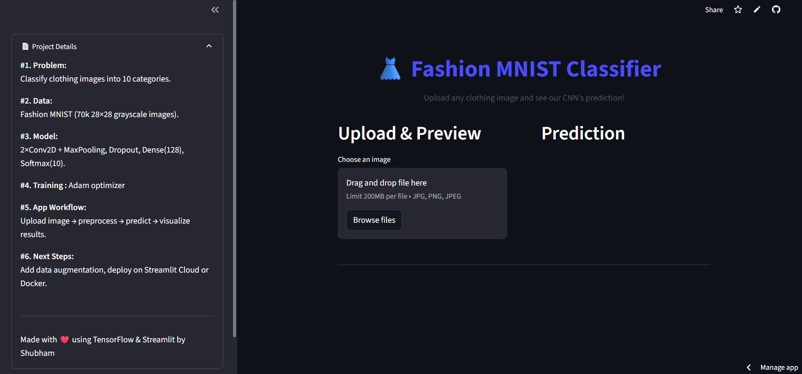

# 👗 Fashion MNIST CNN & Streamlit App



## 🔍 Overview

This project demonstrates an end-to-end deep learning pipeline:

1. **Jupyter Notebook**  
   – Train a CNN on the Fashion MNIST dataset  
   – Architecture:  
     - 2× Conv2D + MaxPooling  
     - Dropout for regularization  
     - Dense(128) → Dropout → Softmax(10)  
   – Optimizer: Adam, Loss: sparse_categorical_crossentropy  
   – Callbacks: ModelCheckpoint, EarlyStopping, TensorBoard  

2. **Streamlit App**  
   – Upload **any** clothing image (JPG/PNG)  
   – Auto-preprocess → Grayscale → Resize to 28×28 → Normalize  
   – Real-time prediction & confidence bar chart  
   – Clean UI with sidebar “Project Details” and custom CSS  

---

## 📂 Repository Structure

```plaintext
fashion-mnist-cnn/
├── data/
│   ├── fashion-mnist_train.csv.zip
│   └── fashion-mnist_test.csv.zip
├── notebooks/
│   └── Fashion_MNIST.ipynb
├── app.py
├── fashion_mnist_model.h5
├── requirements.txt
├── runtime.txt
├── README.md
└── .gitignore
````

> **Note:** Before running anything, unzip both `*.zip` files **in the `data/` folder** so that `fashion-mnist_train.csv` and `fashion-mnist_test.csv` appear alongside.

---

## ⚙️ Installation & Setup

1. **Clone the repo**

   ```bash
   git clone https://github.com/yourusername/fashion-mnist-cnn.git
   cd fashion-mnist-cnn
   ```

2. **Extract data**

   ```bash
   unzip data/fashion-mnist_train.csv.zip -d data/
   unzip data/fashion-mnist_test.csv.zip  -d data/
   ```

3. **Create & activate a Python environment**

   ```bash
   python3 -m venv venv
   source venv/bin/activate      # macOS/Linux
   venv\Scripts\activate         # Windows
   ```

4. **Install dependencies**

   ```bash
   pip install -r requirements.txt
   ```

---

## 🚀 How to Run

### 1. Train & Evaluate (Notebook)

* Open `notebooks/Fashion_MNIST.ipynb`
* Run all cells to preprocess data, build the model, train, visualize metrics, and save `fashion_mnist_model.h5`.

### 2. Launch Streamlit App

```bash
streamlit run app.py
```

* In your browser, upload any clothing image and click **Predict**.
* View processed 28×28 input, top-1 class, and full confidence chart.


---

## 🔮 Next Steps

* Add **data augmentation** (rotations, flips, noise) to improve robustness
* Experiment with **transfer learning** on real-world photos
* Package in **Docker** or deploy on **Streamlit Cloud**
* Extend to a **full web service** (FastAPI/Flask + React frontend)

---

## ❤️ Acknowledgments

* Fashion MNIST dataset by Zalando Research
* Built with **TensorFlow Keras** and **Streamlit**
* Inspired by community tutorials on end-to-end deep learning demos

```
```
